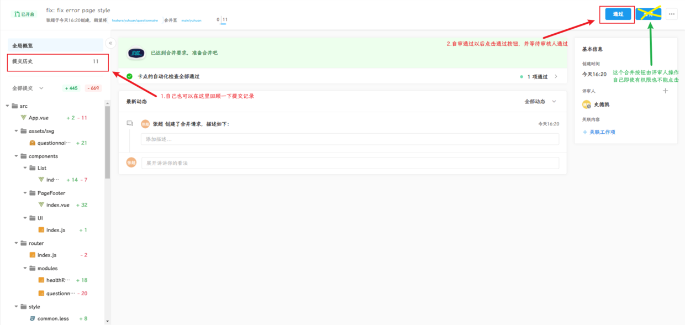

# code review 时机

 

# 角色职责

| 角色      | 规则                                                                                          |
| --------- | --------------------------------------------------------------------------------------------- |
| Developer | 1、**一次提交的功能必须是完整的**                                                             |
|           | 2、默认细粒度提交（以独立的方法/功能/模块为单位）。如需粗粒度提交，需提前跟 Reviewer 沟通确认 |
|           | 3、**Commit Message 中要清晰描述变更的主题**                                                  |
|           | 必要时，可以以链接或者文件的形式附上需求文档/设计文档                                         |
| Reviewer  | 1、**不允许自我 Review 并 Merge 代码**                                                        |
|           | 2、Review 不通过打回前需跟 Developer 说明原因并达成一致                                       |
|           | 3、Review 不通过需明确填写打回的原因                                                          |
|           | 4、**单次 Review 时长需控制在 2 分钟~2 小时内完成**（特殊情况请说明原因）                     |
| Approver  | 1、**审批不通过需注明原因**                                                                   |
|           | 2、审批时长需要控制在 1 小时以内                                                              |
|           | 3、对于放行的非质量问题，需持续跟进                                                           |

# CR 流程

1. 目前代码托管平台上的代码仓库 master 或 main 分支为保护分支，需要进行线上合并。首先每个人新增自己的开发分支 feature/xxx 或 feature/xxx-yyy（yyy 代表具体功能），并且**遵循一个功能一个开发分支的原则**，上传到线上后，发起合并请求，**交由审评员进行代码合并**；
1. 至少两人一个项目，合并时代码时，指派另一人为审评员，通过后才可合并代码，同时**评审员保存下自己认为良好的代码片段和烂代码（烂代码和如果发现潜在打回修改以后，再次发起重新合并）**；
1. 某个需求（项目）留给**开发时间非常紧张时**，可以**暂时不进行 CR**，告知 Reviewers，优先保证按时需求（项目）上线，**在项目看板上记录此次原因并事后再补上**；
1. **团队 Code Review** 每一周或两周进行一次，视日程闲忙而定，主要**分享平时团队成员 CR 的一些情况和会上再随机抽查一些代码一起审查**；

# CR 标准

1. 不纠结编码风格，编码风格交给 eslint、stylelint；
1. 代码注释、字段注释、文档注释等；
1. 代码可读性，过多嵌套、低效冗余代码、功能独立、可读性变量方法命名等；
1. 代码可扩展性，功能方法设计是否合理、模块拆分等；
1. 控制 review 时间成本，reviewer 尽量由项目责任人组成，关注代码逻辑，无需逐字逐句理解；

# 举个栗子 🌰

1. 远程已存在 main/xxx 分支，首先基于 main/xxx 迁出 feature/xxx 或 feature/xxx-yyy， 作为本地开发分支，其中 yyy 代表当前本地正在开发的功能

2. 当本地 feature/xxx 开发完毕时，推送到 codeup 上，使用「合并请求」功能

>  >  >  > 

3. 此时审核人的钉钉会收到代码评审的通知，打开可以看到每一个 commit 和代码变动情况

>  逐行审阅完毕后，进行手续操作 

4. 完。
