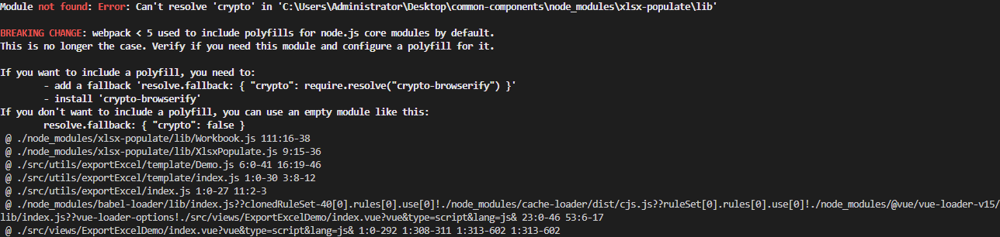
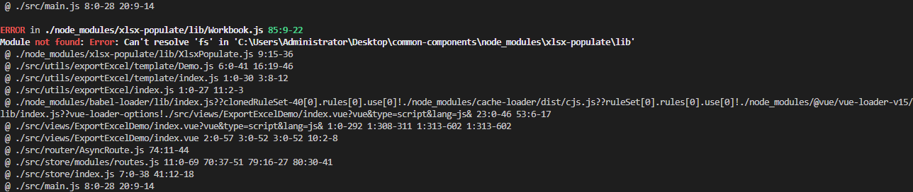

## Github

-   https://github.com/dtjohnson/xlsx-populate

## 目录

    ├── src/utils/exportExcel
    ├── template // 文件模板
    │   ├── Demo.js // 模板文件
    │   └── index.js // 模板导出
    ├── tools // 通用工具方法
    │   ├── columnMap.js // 表格列标注映射
    │   ├── mergeRange.js // 合并单元格
    │   ├── saveAs.js // 下载文件流
    └── index.js

## 基本使用

1、装包

```
npm install xlsx-populate or yarn add xlsx-populate
```

2、导入方法 ​

```
import exportExcel from '@/utils/exportExcel'
```

3、执行方法

    /**
    * @param {Object} data 表格数据
    * @param {String} type 导出模板名称
    * @param {String} name 导出文件名称
    */
    exportExcel(res.list, 'Demo', 'demo')

## 合并单元格

目前方法中内置的是合并横向单元格，也可以自由进行定义，核心是使用下面的这个方法

```
sheet.range('A1:B1').merged(true) // 'A1:B1' 指定合并单元格区域
```

## 模板文件说明

调用导出方法时，需要先提供当前需要导出表格对应的模板文件

-   创建表格，会返回一个 Promise
    ```
    const workbook = await XlsxPopulate.fromBlankAsync()
    ```
-   获取工作表，设置工作表中的内容
    ```
    var sheet = workbook.sheet(0)
    ```
-   设置工作表的绘制区域，并设置值
    ```
    sheet.range('A1:F10').value(data)
    ```
-   设置表格样式 [API 文档](https://github.com/dtjohnson/xlsx-populate#styles-1)
    -   设置行高度
        ```
        sheet.row(i).height(30)
        ```
    -   设置列宽度
        ```
        sheet.column(1).width(15)
        ```
    -   设置单元格样式
        ```
        sheet.cell('A1').style({
            bold: true, // 设置边框
            border: 'thin', // 边框样式
            fill: 'f0f0f0', // 填充颜色
            horizontalAlignment: 'center', // 水平居中
        })
        ```
-   导出设置完成的表格
    ```
    return workbook.outputAsync({ type: 'blob' })
    ```

## Tips

在 vue-cli 4.x 中装包后即可正常使用，而在 vue-cli 5.x 中会出现一些问题，以下是解决方案

-   [webpack < 5 used to include polyfills for node.js core modules by default](https://blog.csdn.net/FantasyWeirdo/article/details/123552064) 

    ```
    yarn add node-polyfill-webpack-plugin

    vue.config.js:

    const NodePolyfillPlugin = require('node-polyfill-webpack-plugin')
    ...
        configureWebpack: {
            plugins: {
                new NodePolyfillPlugin()
            }
        }
    ...
    ```

-   [Can't resolve 'fs' in ... 'node_modules\xlsx-populate\lib'](https://github.com/dtjohnson/xlsx-populate/issues/42) 

    ```
    vue.config.js:

    ...
        externals: {
            fs: require('fs'),
        },
    ...
    ```

    ​
