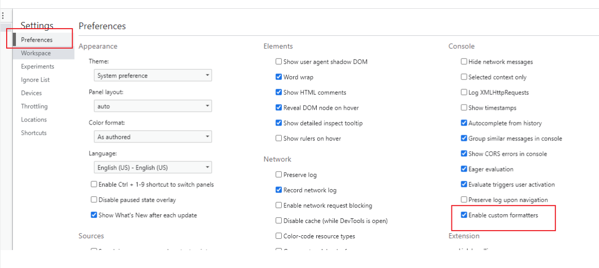
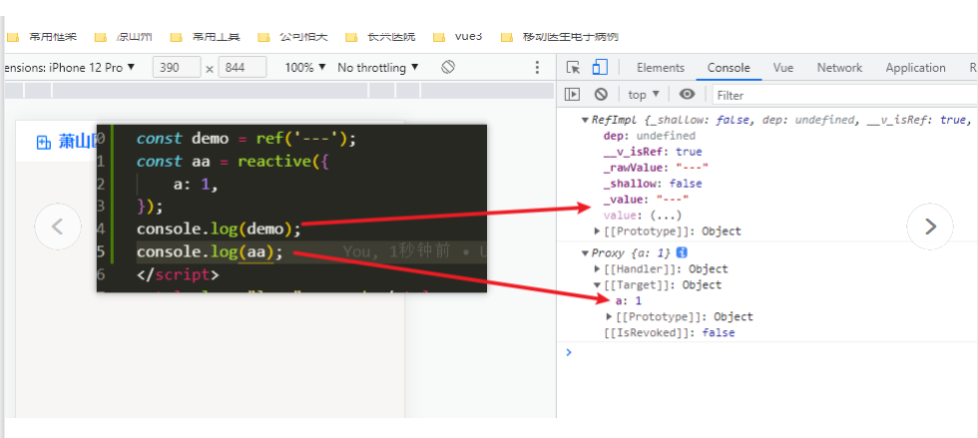
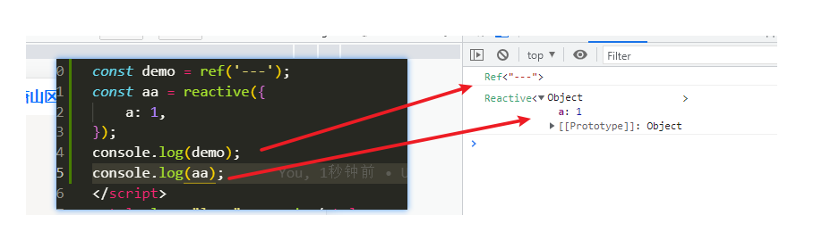

## 覆盖一个 reactive 对象

```
<script lang="ts">
import { defineComponent, reactive, onMounted } from "vue";

export default defineComponent({
  name: "HelloWorld",
  setup() {
    let myReactiveObject = reactive({
      name: "Nicky",
      age: "37",
      country: "DK",
    });

    let newObject = {
      name: "Nicky Christensen",
      age: "36",
      country: "DA-DK",
    };

    onMounted(() => {
      setTimeout(() => {
        //myReactiveObject = newObject // Wont work
        Object.assign(myReactiveObject, newObject) // Will work
      }, 2000)
    })

    return {
      myReactiveObject,
    };
  },
});
</script>
```

## CSS Features

#### 将 CSS 直接绑定到你的变量

```
// ........
const color = ref('#f000');
<style>
.text {
  color: v-bind(color);
}
</style>
```

#### 使用 v-global(缩写:global) 应用全局样式

```
<style scoped>
// v-global
:global(.red) {
  color: red;
}
</style>
```

#### 使用 v-deep(缩写:deep)

`>>>` 和 `/deep/` 已弃用， `::v-deep` 已更变为（`::v-deep(.bar) {}`)

```
<style scoped>
// .a v-deep(.b) {
.a :deep(.b) {
  /* ... */
}
</style>
```

### 使用 v-slotted(缩写:slotted)

默认情况下，从父级传入的槽内容不再受子范围样式的影响。相反，子级现在需要使用新的 ::v-slotted（） 伪元素来专门针对插槽内容：

```
<style scoped>
// v-slotted(.b) {
:slotted(.b) {
  /* ... */
}
</style>
```

## 全局注册组件

```
import MyGlobalSection from '@/components/MyGlobalSection.vue';

// vue2
// import Vue from 'vue'
// Vue.component(MyGlobalSection.name, MyGlobalSection);

// vue3
import App from "./App.vue";
const app = createApp(App);
app.component(MyGlobalSection.name, MyGlobalSection);
app.mount("#app");
```

## 使用 v-once or v-memo 提升性能

```
// v-once
<template>
  <!-- single -->
  <p v-once>{{ someProperty }}</p>
  <!-- with children -->
  <div v-once>
    <p>{{ someProperty}}</p>
  </div>
  <!-- components -->
  <my-component v-once />
  <!-- v-for directives -->
  <li v-for="”item" in items” v-once>{{item}}</li>
</template>
```

```
// v-memo
<div v-memo="[valueA, valueB]">
  ...
</div>
```

> 只有 valueA or valueB 变更的时候才会更新，值得注意的是，**v-memo 不能在 v-for 使用**

## 组件的异步加载

```
import { defineAsyncComponent } from "vue";

// Lazy Load
const myComponent = defineAsyncComponent(() =>
  import("./components/myComponent.vue")
);

// 完整的配置
const myComponent = defineAsyncComponent({
  loader: () => import("./myComponent.vue"),
  loadingComponent: myLoadingComponent,
  errorComponent: myErrorComponent,
  delay: 1000 /* 延迟时间，在 loading component 之前*/,
  timeout: 3000 /* 超时时间 */,
});
```

## 浏览器设置，打印结果更加清晰


修改设置前

修改设置后，打印结果更加清晰

